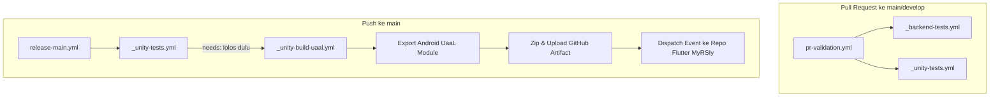

# Dokumen Setup CI/CD — DARSI Indoor Navigation

Dokumen ini mencakup arsitektur, panduan konfigurasi, dan alur kerja **CI/CD** untuk
proyek **DARSI-Indoor Navigation**.

> **Status per 2026-08-14:** CI **belum jalan** — nol GitHub Secrets terpasang di repo
> ini. Setiap workflow yang menyentuh Unity gagal di langkah aktivasi lisensi. Lihat
> §3 untuk cara memperbaikinya. Ini bukan bug di workflow — arsitekturnya sudah benar,
> cuma langkah setup manual (sekali jalan) belum selesai.

---

## 🏗️ 1. Arsitektur Pipeline CI/CD

Sejak perombakan ke **pipeline modular reusable** (`dbfdb0d`), workflow dipecah jadi
dua **entry point** (dipicu event) yang memanggil workflow **reusable** (dipicu
`workflow_call`, tidak bisa jalan sendiri):



Catatan penting: di `release-main.yml`, `_unity-build-uaal.yml` **menunggu**
`_unity-tests.yml` lolos dulu (`needs:`) — build UaaL tidak jalan kalau test Unity gagal.

---

## 📂 2. Daftar Workflow GitHub Actions

| File Workflow | Jenis | Trigger | Fungsi Utama |
| :--- | :--- | :--- | :--- |
| [pr-validation.yml](file:///.github/workflows/pr-validation.yml) | entry point | `pull_request` (main/develop) | Panggil test backend + Unity secara paralel |
| [release-main.yml](file:///.github/workflows/release-main.yml) | entry point | `push` ke main | Panggil test Unity, lalu build UaaL kalau lolos |
| [_backend-tests.yml](file:///.github/workflows/_backend-tests.yml) | reusable | `workflow_call` | Linting `ruff` & `pytest` untuk `Backend/` (Python YOLO API) |
| [_unity-tests.yml](file:///.github/workflows/_unity-tests.yml) | reusable | `workflow_call` | Unity EditMode & PlayMode test via `game-ci/unity-test-runner@v4` |
| [_unity-build-uaal.yml](file:///.github/workflows/_unity-build-uaal.yml) | reusable | `workflow_call` | Full Android UaaL Export via [UaaLBuildScript.cs](file:///Assets/Editor/UaaLBuildScript.cs) + Artifact Upload + dispatch ke MyRSIy |

> File-file lama (`fast-ci.yml`, `build-uaal.yml`, `backend-ci.yml`) yang pernah
> disebut di versi dokumen ini **sudah tidak ada** — diganti struktur di atas.

---

## 🔑 3. Konfigurasi Secrets di GitHub Repository

**Ini langkah manual, sekali jalan, dan HARUS dilakukan di luar CI** — cara lama
(action `game-ci/unity-request-activation-file`) **sudah dipensiunkan resmi oleh
game-ci** per 2026-08 (terkonfirmasi lewat run gagal `#31794450941`:
*"This action is no longer supported"*). Jangan coba pakai action itu lagi.

### Cara yang benar sekarang (dari dokumentasi resmi game-ci)

1. Buka **Unity Hub** di komputermu → `Preferences → Licenses → Add → Get a free
   personal license`
2. Cari file `Unity_lic.ulf` di OS-mu:
   - Windows: `C:\ProgramData\Unity\Unity_lic.ulf`
   - Mac: `/Library/Application Support/Unity/Unity_lic.ulf`
   - Linux: `~/.local/share/unity3d/Unity/Unity_lic.ulf`
3. Di GitHub: `Settings → Secrets and variables → Actions → New repository secret`,
   buat tiga secret ini:
   - **`UNITY_LICENSE`** — isi teks lengkap file `.ulf` di atas
   - **`UNITY_EMAIL`** — email akun Unity kamu
   - **`UNITY_PASSWORD`** — password akun Unity kamu

**Tidak perlu workflow aktivasi terpisah.** `game-ci/unity-builder@v4` dan
`game-ci/unity-test-runner@v4` yang sudah dipakai di `_unity-tests.yml` dan
`_unity-build-uaal.yml` **sudah menangani aktivasi otomatis** begitu tiga secret di
atas terisi — cukup jalankan ulang workflow yang gagal setelah secret terpasang.

### 2. Integrasi Cross-Repo ke Flutter (Opsional)
- **`FLUTTER_DISPATCH_TOKEN`**: Personal Access Token (PAT) GitHub dengan scope `repo`
  untuk memicu pipeline build otomatis di repository Flutter `RockHead07/MyRSIy`. Kalau
  kosong, langkah dispatch di `_unity-build-uaal.yml` di-skip otomatis (`if:
  env.DISPATCH_TOKEN != ''`), tidak bikin build gagal.

---

## 🛠️ 4. Cara Kerja Export UaaL (Unity as a Library)

Dalam `_unity-build-uaal.yml`, Game-CI mengeksekusi method khusus C# yang telah dibuat
di [Assets/Editor/UaaLBuildScript.cs](file:///Assets/Editor/UaaLBuildScript.cs):

```csharp
UaaLBuildScript.BuildAndroidUaaL();
```

Method ini mengaktifkan bendera `exportAsGoogleAndroidProject = true;` dan menghasilkan
folder Android Project eksternal yang berisi modul `unityLibrary`. Hasil build ini
kemudian di-zip menjadi `unity-android-uaal-export.zip` dan diunggah sebagai
**GitHub Artifact**.

Developer Flutter dapat mengunduh `.zip` ini dan memasukkannya langsung ke dalam
proyek Flutter **MyRSIy** sebagai modul Unity.

---

## ⚡ 5. Optimasi Performa Build (Caching)

Untuk mempercepat build Unity di GitHub Actions:
- Folder `Library/` di-cache berdasarkan hash file `Assets/` dan `Packages/`.
- Dengan caching, build berikutnya tidak perlu melakukan re-import seluruh aset 3D dan
  package SDK dari awal, sehingga menghemat waktu 50–70%.

---

## 🩺 6. Diagnosis Cepat Kalau CI Merah

| Gejala di log | Penyebab | Perbaikan |
|---|---|---|
| `Missing Unity License File and no Serial was found` | Secret `UNITY_LICENSE`/`UNITY_EMAIL`/`UNITY_PASSWORD` belum ada/salah | Ikuti §3 |
| `Unable to resolve action ...@vN` | Versi action di-pin ke tag yang tidak ada | Cek release terbaru action itu di GitHub |
| `This action is no longer supported` | Action sudah dipensiunkan upstream | Cari pengganti resmi di docs upstream — jangan cuma ganti versi |
| Ruff gagal di `_backend-tests.yml` | Pelanggaran lint nyata di `Backend/` | `ruff check Backend/` lokal untuk lihat detail, banyak yang `--fix`-able |
| `build-unity-uaal` skip (`-`) padahal push ke main | `run-unity-tests` gagal duluan — `needs:` mencegah build jalan | Perbaiki test Unity dulu |

Cek status run terkini: `gh run list --limit 10` (butuh `gh auth login` sekali).
