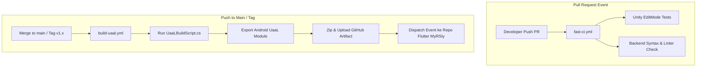

# Dokumen Setup CI/CD — DARSI Indoor Navigation

Dokumen ini mencakup arsitektur, panduan konfigurasi, dan alur kerja **CI/CD Best Practice** untuk proyek **DARSI-Indoor Navigation**.

---

## 🏗️ 1. Arsitektur Pipeline CI/CD

Pipeline CI/CD ini mengadopsi pola **UaaL (Unity as a Library)** dan **Multi-tier CI**:



---

## 📂 2. Daftar Workflow GitHub Actions

| File Workflow | Trigger | Fungsi Utama |
| :--- | :--- | :--- |
| [fast-ci.yml](file:///.github/workflows/fast-ci.yml) | `pull_request` (main/develop) | Validation cepat: C# compilation & EditMode unit tests. |
| [build-uaal.yml](file:///.github/workflows/build-uaal.yml) | `push` main / Tag `v*` / Manual | Full Android UaaL Export via [UaaLBuildScript.cs](file:///Assets/Editor/UaaLBuildScript.cs) + Artifact Upload. |
| [backend-ci.yml](file:///.github/workflows/backend-ci.yml) | Changes di `Backend/**` | Linting `ruff` & testing unit service Python YOLO API. |

---

## 🔑 3. Konfigurasi Secrets di GitHub Repository

Untuk menjalankan Game-CI di GitHub Actions, kamu perlu menambahkan **Repository Secrets** di GitHub (`Settings -> Secrets and variables -> Actions`):

### 1. Game-CI Unity License Credentials
- **`UNITY_LICENSE`**: Isi dengan isi teks dari file lisensi Unity (`.ulf`) kamu, atau
- **`UNITY_EMAIL`**: Email akun Unity milikmu.
- **`UNITY_PASSWORD`**: Password akun Unity milikmu.

> **Catatan Lisensi Unity Personal (Gratis)**:
> Jika menggunakan Unity Personal, kamu bisa membuat lisensi `.ulf` dengan mengikuti langkah aktivasi resmi Game-CI di [Game-CI License Activation Guide](https://game.ci/docs/github/activation).

### 2. Integrasi Cross-Repo ke Flutter (Opsional)
- **`FLUTTER_DISPATCH_TOKEN`**: Personal Access Token (PAT) GitHub dengan scope `repo` untuk memicu pipeline build otomatis di repository Flutter `RockHead07/MyRSIy`.

---

## 🛠️ 4. Cara Kerja Export UaaL (Unity as a Library)

Dalam pipeline [build-uaal.yml](file:///.github/workflows/build-uaal.yml), Game-CI mengeksekusi method khusus C# yang telah dibuat di [Assets/Editor/UaaLBuildScript.cs](file:///Assets/Editor/UaaLBuildScript.cs):

```csharp
UaaLBuildScript.BuildAndroidUaaL();
```

Method ini mengaktifkan bendera `exportAsGoogleAndroidProject = true;` dan menghasilkan folder Android Project eksternal yang berisi modul `unityLibrary`. Hasil build ini kemudian di-zip menjadi `unity-android-uaal-export.zip` dan diunggah sebagai **GitHub Artifact**.

Developer Flutter dapat mengunduh `.zip` ini dan memasukkannya langsung ke dalam proyek Flutter **MyRSIy** sebagai modul Unity.

---

## ⚡ 5. Optimasi Performa Build (Caching)

Untuk mempercepat build Unity di GitHub Actions:
- Folder `Library/` di-cache berdasarkan hash file `Assets/` dan `Packages/`.
- Dengan caching, build berikutnya tidak perlu melakukan re-import seluruh aset 3D dan package SDK dari awal, sehingga menghemat waktu 50–70%.
