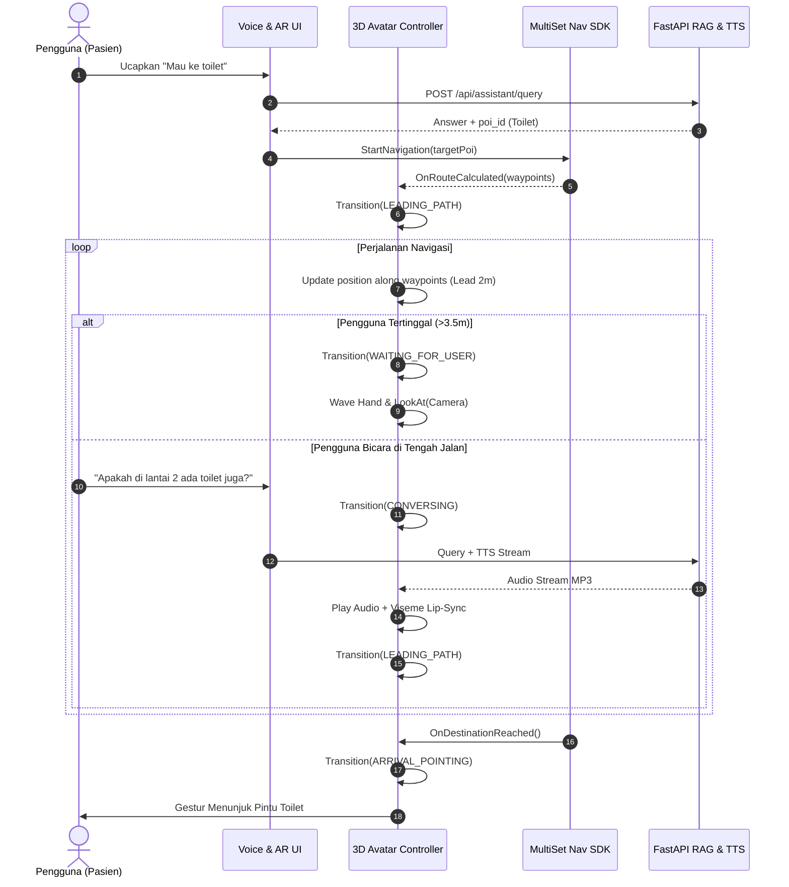

# Design Specification: 3D Virtual AI Avatar Guide (VRM + RAG + Lead-Follow AR Navigation)

**Document ID:** SPEC-DARSI-3D-AVATAR-01  
**Date:** 2026-08-22  
**Status:** APPROVED FOR IMPLEMENTATION  
**Author:** AI Pair Programming (DARSI Team)  
**Target Execution:** 2026-08-23  

---

## 1. Executive Summary & Goals

Fitur **3D Virtual AI Avatar Guide** menghadirkan pemandu virtual 3D interaktif (bergaya karakter ekspresif seperti di *MiSide* / karakter humanoid VRoid) yang memandu pasien dan pengunjung di lingkungan fisik RS Islam A. Yani.

### Core Value & UX Goals:
1. **Immersive Lead-Follow Navigation:** Avatar berjalan 1.5 – 2.5 meter di depan pengguna mengikuti rute polyline AR MultiSet SDK, menyesuaikan kecepatan, berhenti & menunggu jika pengguna tertinggal, serta menoleh menatap pengguna.
2. **Interactive Realtime Dialogue:** Pengguna dapat berbicara kapan saja selama navigasi. Avatar akan berhenti sejenak, berputar menghadap kamera AR, mendengarkan, menjawab via suara Text-to-Speech (TTS) natural Bahasa Indonesia dengan animasi *viseme lip-sync*, lalu melanjutkan perjalanan.
3. **Arrival & POI Pointing Gesture:** Saat tiba di depan ruangan tujuan (misal: IGD, Farmasi, Toilet), avatar berhenti dan memutar animasi gestur menunjuk pintu ruangan (*pointing gesture*).

---

## 2. System Architecture

```
                  ┌────────────────────────────────────────┐
                  │      3D Avatar Guide (UniVRM / FSM)    │
                  └───────────────────┬────────────────────┘
                                      │
         ┌────────────────────────────┼────────────────────────────┐
         ▼                            ▼                            ▼
  [ 🚶 Path Following ]      [ 🗣️ RAG & Voice / TTS ]     [ 🎭 Gesture & Express ]
  • Lead-Follow Controller   • VoiceInputHandler.cs       • Mecanim State Machine
  • MultiSet Waypoints sync  • FastAPI /api/assistant/tts • Lip-Sync Viseme Proxy
  • Dynamic speed adjustment • Edge-TTS (id-ID-GadisNeural• Eye Look-At Tracking
```

---

## 3. Finite State Machine (FSM) Avatar Controller

Perilaku avatar diatur oleh State Machine modular dalam [`AIAvatarGuideController.cs`](file:///D:/Dev/Projects/UnityProjects/Learning/DARSI-Indoor%20Navigation/Assets/Scripts/Avatar/AIAvatarGuideController.cs):

```
                     ┌───────────────┐
                     │   IDLE_STAND  │ (Menunggu rute / diam)
                     └───────┬───────┘
                             │ OnRouteStarted
                             ▼
 ┌───────────────────► LEADING_PATH ◄───────────────────┐
 │                     │         ▲                      │
 │ User Distance >3.5m │         │ User Distance <2.0m  │ Dialogue Finished
 │                     ▼         │                      │
 │               WAITING_FOR_USER                       │
 │                                                      │
 │                                                      │
 │ Voice Input Triggered                                │ Voice Input Triggered
 └───────────────────►   CONVERSING   ──────────────────┘
                       (Pause & Face User)
                             │
                             │ Distance to Destination < 1.5m
                             ▼
                     ARRIVAL_POINTING
                   (Menunjuk pintu POI)
```

### State Definitions & Behavior Matrix:

| State | Deskripsi Perilaku | Animasi Mecanim | Parameter Look-At |
|---|---|---|---|
| **`IDLE_STAND`** | Berdiri di samping titik awal, menyapa pengguna dengan lambaian tangan. | `Idle_Friendly` | Menatap ke `Camera.main` |
| **`LEADING_PATH`** | Berjalan di sepanjang waypoints rute AR MultiSet, menjaga jarak 1.5–2.5m di depan pengguna. | `Walk_Forward` | Menghadap ke arah waypoint rute berikutnya |
| **`WAITING_FOR_USER`** | Terpicu jika jarak pengguna $> 3.5$ meter. Avatar berhenti, berbalik badan, melambaikan tangan. | `Wait_Wave` | Menatap ke `Camera.main` |
| **`CONVERSING`** | Terpicu saat pengguna menekan Mic/bicara. Avatar berhenti, berbalik 180° menghadap pengguna, menggerakkan mulut dengan viseme lip-sync saat audio TTS berputar. | `Talk_Expressive` | Menatap ke `Camera.main` |
| **`ARRIVAL_POINTING`**| Terpicu saat tiba di titik akhir POI ($< 1.5$ meter). Avatar berhenti dan memutar gestur menunjuk pintu. | `Point_Right` / `Point_Left` | Menatap ke POI lalu menatap kembali ke pengguna |

---

## 4. Component Breakdown & Specifications

### 4.1. Unity Client Components (`Assets/Scripts/Avatar/`)

1. **`AIAvatarGuideController.cs`**:
   * **Fungsi:** Mengatur state machine, interpolasi pergerakan di sepanjang `List<Vector3> waypoints` dari MultiSet Navigation Manager.
   * **Lead-Follow Math:**
     * `leadDistanceMin = 1.5f`
     * `leadDistanceMax = 2.8f`
     * `catchupThreshold = 3.5f`
     * Kecepatan jalan adaptif: $v = v_{\text{base}} \times \text{clamp}\left(\frac{d_{\text{user}}}{d_{\text{target}}}, 0.5, 1.5\right)$.

2. **`AvatarSpeechLipSync.cs`**:
   * **Fungsi:** Mengambil sampel audio buffer dari `AudioSource`, menghitung RMS / spectrum level, dan menggerakkan viseme vokal VRM (`A`, `I`, `U`, `E`, `O`) secara halus.
   * **Integrasi UniVRM:** Menggunakan `VRMBlendShapeProxy.SetValue(BlendShapePreset.A, weight)`.

3. **`AvatarLookAtController.cs`**:
   * **Fungsi:** Mengontrol rotasi leher dan bola mata avatar secara dinamis menggunakan `VRMLookAtHead` ke `Camera.main.transform` dengan pembatasan sudut rotasi natural (maksimal 70° horizontal).

---

### 4.2. Backend Components (`darsi-backend/`)

1. **`app/assistant/tts.py`**:
   * **Library:** `edge-tts` (Microsoft Edge Neural Voice).
   * **Voice Model:** `id-ID-GadisNeural` (suara wanita ramah natural) atau `id-ID-ArdiNeural` (suara pria profesional).
   * **Endpoint:** `POST /api/assistant/tts`
     * Request: `{"text": "Silakan ikuti saya, kita menuju ke ruang IGD di Lantai 1."}`
     * Response: Audio stream MP3 (`audio/mpeg`) atau audio cache URL.

2. **Integrasi Router (`app/assistant/router.py`)**:
   * Memperluas `AssistantQueryResponse` dengan field opsional `tts_audio_base64` atau endpoint URL audio langsung untuk efisiensi latensi mobile.

---

## 5. VRM 3D Asset Guidelines & Mobile Guardrails

Untuk menjaga performa 60 FPS pada perangkat Android saat menjalankan ARCore + MultiSet VPS:

| Parameter Asset | Batas Maksimum (Guardrail) | Keterangan |
|---|---|---|
| **Format Model** | `.vrm` (VRM 0.x via UniVRM) | Format standar glTF 2.0 Humanoid |
| **Polygon Count** | $\le 15.000$ Triangles | Mengoptimalkan vertex processing di GPU mobile |
| **Draw Calls / Materials** | 1 – 2 Material (Atlas) | Semua tekstur dibake ke 1 file atlas 1024x1024 |
| **SpringBones (Physics)** | $\le 8$ Nodes (atau OFF) | Mematikan fisika rambut/baju berlebih untuk hemat CPU |
| **Rigging** | Humanoid Mecanim Compatible | Kompatibel dengan animasi Mixamo / Unity Standard |

---

## 6. Sequence Flow: Navigasi dengan Pemandu Virtual



---

## 7. Implementation Checklist & Verification Plan

### Phase 1: Backend TTS Endpoint (FastAPI)
- [ ] Instalasi `edge-tts` di backend container.
- [ ] Implementasi endpoint `POST /api/assistant/tts`.
- [ ] Unit test audio synthesis latency ($< 500$ ms).

### Phase 2: Unity Avatar Rigging & State Machine
- [ ] Import UniVRM package / setup VRM Humanoid prefab di Unity.
- [ ] Setup Mecanim Animator Controller (`Idle`, `Walk`, `Wave`, `Talk`, `Point`).
- [ ] Implementasi `AIAvatarGuideController.cs` dengan lead-follow waypoint math.

### Phase 3: Audio Lip-Sync & Look-At Tracking
- [ ] Implementasi `AvatarSpeechLipSync.cs` menghubungkan audio buffer ke `VRMBlendShapeProxy`.
- [ ] Konfigurasi `VRMLookAtHead` menatap `Camera.main`.

### Phase 4: End-to-End Integration & Field Validation
- [ ] Uji coba rute AR di scene `TestingHCM.unity`.
- [ ] Verifikasi transisi mulus antar state saat pengguna berjalan, berhenti, dan bertanya.
- [ ] Verifikasi stabilitas FPS mobile Android ($\ge 45-60$ FPS).
