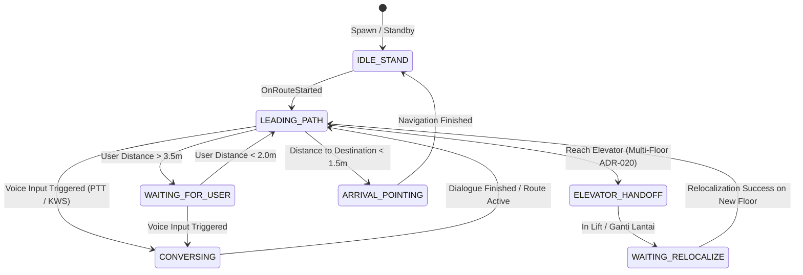

# Design Specification: End-to-End AI Avatar Assistant Guide (VRM + RAG + Hybrid Voice + Lead-Follow AR Navigation)

**Document ID:** SPEC-DARSI-AI-ASSISTANT-E2E-02  
**Date:** 2026-08-23  
**Status:** APPROVED FOR IMPLEMENTATION (BRAINSTORMING COMPLETED)  
**Author:** Bagus & AI Assistant (DARSI Team)  
**Target Execution:** Phase 1 – Phase 5  

---

## 1. Executive Summary & Goals

Fitur **AI Avatar Assistant Guide** menghadirkan pemandu virtual 3D humanoid interaktif (berkarakter perawat/petugas medis RS modern) yang mendampingi dan memandu pasien/pengunjung di lingkungan fisik **RS Islam A. Yani**.

### Core Value & UX Goals:
1. **Immersive Lead-Follow AR Navigation:** Avatar berjalan 1.5 – 2.5 meter di depan pengguna menelusuri rute navigasi MultiSet SDK, menyesuaikan kecepatan secara adaptif, berhenti & menoleh melambaikan tangan jika pengguna tertinggal ($> 3.5$m).
2. **Hybrid Voice Interaction:**
   * **Push-to-Talk (Utama / Default):** Tombol mic melayang di HUD AR untuk kepastian 100% bebas *false trigger*, hemat baterai, dan ramah privasi di koridor RS.
   * **Wake-Word Detection (Opsional / Hands-Free Mode):** Modul *Keyword Spotting (KWS)* lokal berdaya rendah untuk memanggil *"Halo Darsi"* atau *"Hai Darsi"*.
3. **Conversational RAG Brain & Natural Voice:** Menjawab pertanyaan seputar layanan RS (jadwal dokter, alur pendaftaran BPJS, lokasi poli/fasilitas) menggunakan **Retrieval-Augmented Generation (RAG)** dan suara Text-to-Speech (TTS) natural Bahasa Indonesia (*Edge-TTS `id-ID-GadisNeural`*) dengan *viseme lip-sync*.
4. **Segmented Multi-Floor Lift Handoff (ADR-020):** Memandu pengguna sampai ke depan pintu lift, memberikan instruksi lisan untuk naik lift, dan muncul kembali di depan lift lantai tujuan setelah relokalisasi berhasil.
5. **Arrival & POI Pointing Gesture:** Saat tiba di depan ruangan tujuan ($< 1.5$m), avatar memutar animasi gestur menunjuk pintu ruangan (*pointing gesture*).
6. **Hospital Safety & Visual Transparency:** Jika pengguna mendekat $< 0.8$m, avatar bertransisi semi-transparan / *fade-out* agar tidak menghalangi pandangan fisik nyata di koridor RS.

---

## 2. System Architecture & Offloading Strategy

Untuk menjaga performa **60 FPS** pada perangkat Android saat menjalankan ARCore + MultiSet VPS, pemrosesan AI berat **dialihkan sepenuhnya ke Cloud/Server**, sementara HP hanya menangani rendering dan audio visual ringan.

```
┌─────────────────────────────────────────────────────────────────────────────┐
│                            MOBILE CLIENT (UNITY AR)                         │
│                                                                             │
│  ┌───────────────────────┐   ┌────────────────────────┐   ┌──────────────┐  │
│  │   3D Avatar (UniVRM)  │   │ Voice Input (PTT/KWS)  │   │  ARCore/VPS  │  │
│  │  • Lead-Follow FSM    │   │ • Push-to-Talk HUD Mic │   │ • MultiSet   │  │
│  │  • LipSync (A,I,U,E,O)│   │ • "Halo Darsi" (KWS)   │   │ • NavMesh    │  │
│  │  • VRMLookAt Camera   │   │ • Audio Recorder       │   │ • Floor Vis. │  │
│  └───────────▲───────────┘   └───────────┬────────────┘   └───────┬──────┘  │
└──────────────┼───────────────────────────┼────────────────────────┼─────────┘
               │                           │ (HTTP Audio/Text)      │
               │ (Audio Stream MP3)        ▼                        │
┌──────────────┴────────────────────────────────────────────────────┴─────────┐
│                          FASTAPI BACKEND & CLOUD BRAIN                      │
│                                                                             │
│  ┌──────────────────────┐    ┌──────────────────────┐   ┌────────────────┐  │
│  │  Speech-to-Text      │    │  RAG Knowledge Engine│   │  Edge-TTS      │  │
│  │  (Groq Whisper API)  │───►│  • pgvector / Hybrid │──►│  (GadisNeural) │  │
│  │                      │    │  • Groq LLM (Qwen)   │   │  • Audio MP3   │  │
│  └──────────────────────┘    └──────────────────────┘   └────────────────┘  │
└─────────────────────────────────────────────────────────────────────────────┘
```

---

## 3. Finite State Machine (FSM) Avatar Controller

Perilaku avatar diatur oleh State Machine modular dalam [`AIAvatarGuideController.cs`](file:///D:/Dev/Projects/UnityProjects/Learning/DARSI-Indoor%20Navigation/Assets/Scripts/Avatar/AIAvatarGuideController.cs):



### State Matrix & Behavior:

| State | Perilaku Spasial & Fisik | Animasi Mecanim | Dynamic Look-At | Audio / Suara |
|---|---|---|---|---|
| **`IDLE_STAND`** | Berdiri di samping titik awal pengguna. | `Idle_Friendly` | Menatap ke `Camera.main` | Menyapa saat pertama kali spawn |
| **`LEADING_PATH`** | Berjalan di sepanjang waypoints rute AR MultiSet, menjaga jarak 1.5–2.5m di depan user. | `Walk_Forward` | Menghadap arah waypoint berikutnya | - |
| **`WAITING_FOR_USER`** | Berhenti saat user tertinggal ($> 3.5$m), berbalik 180° menghadap user. | `Wait_Wave` | Menatap ke `Camera.main` | Memberi peringatan ramah ("Ayo, lewat sini") |
| **`CONVERSING`** | Berhenti di tempat, berbalik menghadap user saat ditanya. | `Talk_Expressive` | Menatap ke `Camera.main` | Memutar audio TTS RAG + Lip-sync viseme |
| **`ELEVATOR_HANDOFF`**| Berhenti di depan pintu lift asal (ADR-020). | `Point_Forward` | Menatap ke pintu lift lalu ke user | "Silakan naik lift ke lantai tujuan ya" |
| **`ARRIVAL_POINTING`**| Berhenti di depan pintu ruangan POI ($< 1.5$m). | `Point_Right` / `Point_Left` | Menatap ke pintu POI lalu ke user | "Kita sudah sampai di tujuan. Semoga lekas sembuh!" |

---

## 4. Mobile Performance & Safety Guardrails (UaaL Android Safe)

| Parameter | Guardrail / Batasan | Alasan Rekayasa |
|---|---|---|
| **Format 3D** | `.vrm` (VRM 0.x via UniVRM) | Standar glTF 2.0 Humanoid, built-in look-at & standardized blendshapes |
| **Polygon Count** | $\le 15.000$ Triangles | Mengoptimalkan vertex processing GPU mobile di Android |
| **Draw Calls / Materials** | 1 – 2 Material Atlas (1024x1024) | Mencegah lonjakan draw calls agar framerate stabil di 60 FPS |
| **SpringBones (Physics)** | $\le 8$ rantai utama (atau OFF) | Mematikan komputasi fisika rambut/baju berlebih untuk hemat CPU |
| **Audio Processing** | Streaming MP3 via buffer ringan | Tidak melakukan neural synthesis di device |
| **Field-of-View Safety** | Auto Fade-out / Alpha $< 0.8$m | Mencegah avatar menutupi pandangan fisik di lorong RS |

---

## 5. Roadmap & Implementation Breakdown

### Phase 1: Voice & TTS Backend (`darsi-backend`)
* [ ] Implementasi endpoint `POST /api/assistant/tts` menggunakan `edge-tts` (`id-ID-GadisNeural`).
* [ ] Integrasi Groq Whisper STT endpoint (`POST /api/assistant/stt`) untuk transkripsi audio dari mobile.
* [ ] Response audio streaming / Base64 payload optimization ($< 500$ ms latency).

### Phase 2: Unity Avatar Setup & Lead-Follow Controller
* [ ] Import paket UniVRM & setup prefab 3D Humanoid teroptimasi ($\le 15k$ tris).
* [ ] Setup Mecanim Animator Controller (`Idle`, `Walk`, `Wave`, `Talk`, `Point`).
* [ ] Implementasi [`AIAvatarGuideController.cs`](file:///D:/Dev/Projects/UnityProjects/Learning/DARSI-Indoor%20Navigation/Assets/Scripts/Avatar/AIAvatarGuideController.cs) dengan algoritma interpolasi waypoint MultiSet.

### Phase 3: Expression, Lip-Sync & Dynamic Look-At
* [ ] Implementasi [`AvatarSpeechLipSync.cs`](file:///D:/Dev/Projects/UnityProjects/Learning/DARSI-Indoor%20Navigation/Assets/Scripts/Avatar/AvatarSpeechLipSync.cs) menghubungkan buffer audio `AudioSource` ke viseme `VRMBlendShapeProxy` (`A, I, U, E, O`).
* [ ] Implementasi [`AvatarLookAtController.cs`](file:///D:/Dev/Projects/UnityProjects/Learning/DARSI-Indoor%20Navigation/Assets/Scripts/Avatar/AvatarLookAtController.cs) menggunakan `VRMLookAtHead` ke `Camera.main`.
* [ ] Guardrail transparansi jarak dekat ($< 0.8$m).

### Phase 4: AR Navigation & Multi-Floor Integration
* [ ] Integrasi dengan [`FloorTransitionController.cs`](file:///D:/Dev/Projects/UnityProjects/Learning/DARSI-Indoor%20Navigation/Assets/Scripts/Navigation/FloorTransitionController.cs) (State machine lift handoff per ADR-020).
* [ ] Integrasi Push-to-Talk Mic button pada AR Canvas.
* [ ] End-to-end testing pada scene `DARSi-Indoor Navigation.unity`.

### Phase 5: Hands-Free Wake-Word Module (Opsional)
* [ ] Modul Keyword Spotting (KWS) on-device untuk *"Halo Darsi"* sebagai toggle di pengaturan.
