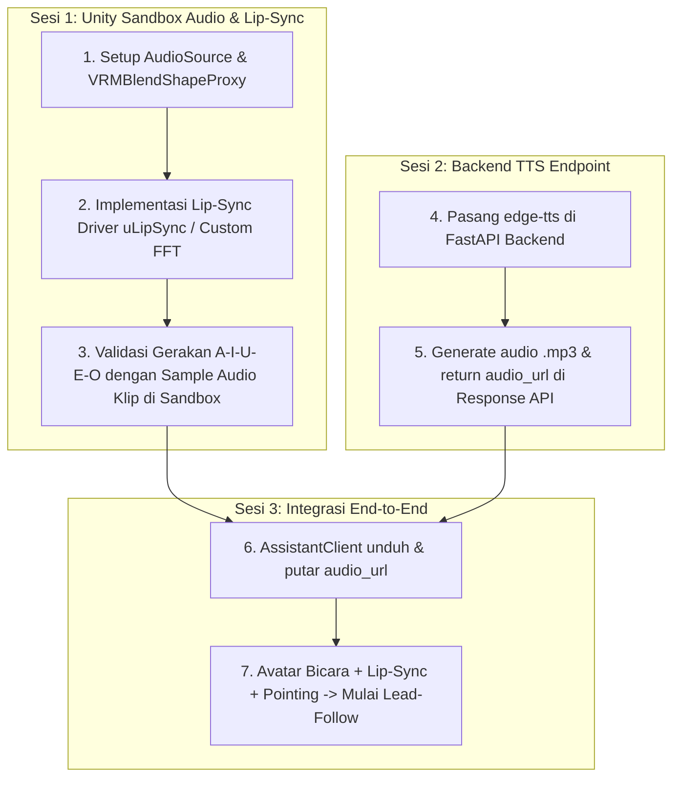

# Voice Output (TTS) & Viseme Lip-Sync Architecture Specification

> **Dokumen:** Kajian Arsitektur, Hasil Riset Ekosistem, dan Pilihan Desain Teknis (Fase 2 Avatar 3D).  
> **Tanggal:** 2026-08-26  
> **Tujuan:** Menjadi referensi komprehensif untuk revalidasi arsitektur bersama Claude Code dan perencanaan implementasi sistem suara & *lip-sync* avatar di DARSI.

---

## 1. Konteks & Status Proyek

### 1.1. Status yang Sudah Selesai (Milestone Terkunci)
* **Visual & Rigging (VRM 0.x):** Menggunakan UniVRM v0.131.2 (`com.vrmc.gltf` + `com.vrmc.univrm`) di Unity 6.3 LTS.
* **Locomotion & Gesture (Mixamo Humanoid):** BlendTree `Idle` (0.0) dan `Walk` (1.589 m/s) terpasang di `AvatarGuide.controller` dengan *speed matching* anti-kaki selip. Dilengkapi gestur *Wave* (menyapa) dan *Point* (menunjuk).
* **Head & Eye Tracking:** `AvatarLookAtController` (rotasi leher/kepala absolut *clamped* 55°) + `VRMLookAtHead` (pelacak arah bola mata ke kamera).
* **Hospital Safety Cutoff (ADR-034 Amandemen 034-A):** `AvatarSafetyFade` mematikan 3/3 renderer avatar saat jarak horizontal $\le 0.50\text{ m}$ dari kamera.
* **Lead-Follow Movement (ADR-034):** `AIAvatarGuideController` menyusuri polyline rute MultiSet SDK tanpa simpangan (0,000 m), menunggu pengguna jika tertinggal, dan terintegrasi dengan serah-terima lift multi-lantai `FloorTransitionController`.
* **Voice Input (STT) & RAG Brain:** Android `SpeechRecognizer` (`id-ID`) aktif di `VoiceInputHandler.cs`. Backend RAG FastAPI (`POST /api/assistant/query`) aktif via Named Tunnel di `https://api-darsi.rockhead07.tech` (ADR-026, ADR-029, ADR-036).

### 1.2. Gate Rilis ADR-034 Keputusan 7
> *"Informasi rute dibawa audio; visual adalah penguat, bukan syarat... Lead-follow TIDAK BOLEH dirilis sebelum TTS berfungsi, untuk mencegah pengguna berjalan di koridor RS sambil terpaku menatap layar HP."*

---

## 2. Analisis Arsitektur Industri (Big Tech Benchmark)

Prinsip dasar arsitektur Mobile AR AI di industri (*Big Tech pattern*: Apple, Google, Meta, Microsoft Azure, Inworld AI, Convai) adalah **"Compute Heavy on Cloud, Render Smooth on Edge"**:

```
[ EDGE / CLIENT ANDROID ]                         [ CLOUD / BACKEND SERVER ]
┌──────────────────────────────────────┐          ┌──────────────────────────────────────┐
│ 1. Voice Input (Mic -> ASR/STT)      │─────────►│ 2. Intent & Vector Search (pgvector) │
│    - Android SpeechRecognizer (id-ID)│          │ 3. LLM Reasoning (Groq LPU / Llama)  │
│                                      │          │ 4. Neural Voice Synth (edge-tts)     │
│ 5. Audio Playback (AudioSource)      │◄─────────│    - id-ID-GadisNeural (.mp3/stream) │
│ 6. Lip-Sync Driver (A-I-U-E-O Viseme)│ (Payload)└──────────────────────────────────────┘
│ 7. 3D Avatar Rendering (60 FPS)      │
│ 8. ARCore & VPS Localization         │
└──────────────────────────────────────┘
```

### Mengapa Beban Dibagi Seperti Ini?
1. **Perlindungan GPU & Frame Budget Mobile:** Di HP Android target, kombinasi Kamera AR + ARCore Tracking + MultiSet VPS Localization sudah mengonsumsi CPU/GPU yang signifikan. Menjalankan LLM lokal atau model TTS neural berat di HP akan memicu *thermal throttling* dan menurunkan FPS di bawah 60 FPS.
2. **Kualitas Bahasa Indonesia Alami:** TTS on-device bawaan OS Android cenderung kaku/robotik dan bergantung pada ketersediaan paket suara di HP pengguna. Model neural cloud (Microsoft Neural Voice) menghasilkan artikulasi bahasa Indonesia yang jauh lebih ramah, jelas, dan manusiawi.

---

## 3. Hasil Riset Teknologi: Lip-Sync Engine (Audio $\rightarrow$ VRM Visemes)

Karakter VRM 0.x memiliki komponen standar `VRMBlendShapeProxy` dengan 5 preset bentuk mulut vokal: **`A`**, **`I`**, **`U`**, **`E`**, **`O`**.

### Opsi A: `hecomi/uLipSync` (Standar Industri Unity Open-Source)
* **Repositori:** [`hecomi/uLipSync`](https://github.com/hecomi/uLipSync) (MIT License)
* **Mekanisme:** Menganalisis audio secara *real-time* menggunakan algoritma **MFCC (Mel-Frequency Cepstral Coefficients)** yang dikompilasi menggunakan **Unity Burst Compiler & Job System**.
* **Integrasi VRM:** Menyediakan komponen bawaan `uLipSyncBlendShape` yang langsung memetakan hasil estimasi fonem audio ke `VRMBlendShapeProxy`.
* **Kelebihan:**
  * Akurasi bentuk bibir sangat presisi per suku kata vokal.
  * Sangat cepat dan efisien di Android karena kode C# di-compile ke native machine code via Burst (tanpa beban Garbage Collector).
  * Sudah teruji luas di ekosistem VTuber/Game Unity Jepang dan global.
* **Kebutuhan Dependensi:** Memerlukan paket UPM `Unity.Burst` dan `Unity.Mathematics`.

### Opsi B: Custom Native C# Spectrum & Formant Analyzer (Zero-Dependency)
* **Mekanisme:** Skrip C# mandiri (`AvatarSpeechLipSync.cs`) yang membaca `AudioSource.GetSpectrumData(samples, 0, FFTWindow.BlackmanHarris)` untuk mengekstrak formants frekuensi dasar vokal:
  * Formant F1 Rendah (300–600 Hz) $\rightarrow$ Vokal `U` / `O`
  * Formant F1 Menengah (700–1000 Hz) $\rightarrow$ Vokal `A`
  * Formant F2 Tinggi (1500–2500 Hz) $\rightarrow$ Vokal `I` / `E`
  * Bobot amplitudo RMS untuk mengontrol bukaan bibir (*jaw opening*).
* **Kelebihan:**
  * **0 dependensi paket eksternal** (murni C# standard Unity).
  * 100% kode berada di dalam codebase DARSI.
* **Trade-off:** Gerakan bibir lebih bersifat ritmis/aproksimasi estetis (gaya anime), bukan akurasi fonetik akustik murni.

---

## 4. Hasil Riset Teknologi: Voice Output (Text-to-Speech / TTS)

| Provider / Library | Tipe | Kualitas Suara (`id-ID`) | Biaya / Akses |
|---|---|---|---|
| **`edge-tts` (`id-ID-GadisNeural`)** *(Rekomendasi Utama)* | Python Server-Side (`pip install edge-tts`) | ⭐⭐⭐⭐⭐ Sangat Alami, Jernih, Ramah | **Gratis / Open Tier**, di-host di FastAPI backend DARSI. |
| **Android Native TTS (`android.speech.tts`)** | Client-Side Java/Android OS Bridge | ⭐⭐☆☆☆ Kaku, suara mekanik/robotik | Gratis & Offline, tetapi kualitas buruk untuk asisten interaktif. |
| **Commercial API (Google Cloud TTS / ElevenLabs)** | Cloud REST API | ⭐⭐⭐⭐⭐ Sangat Alami | Berbayar per karakter / kuota token. |

---

## 5. Rancangan Kontrak Integrasi (API Payload)

### Endpoint: `POST /api/assistant/query`

#### Request Payload:
```json
{
  "user_text": "Di mana letak poli anak dan dokternya siapa?",
  "current_floor": "Lantai 1",
  "building": "RS Islam Ahmad Yani"
}
```

#### Response Payload:
```json
{
  "status": "success",
  "answer": "Poli Anak berada di Lantai 2. Hari ini ada dr. Ahmad Sp.A yang praktek hingga pukul 14.00. Saya siapkan rutenya ya!",
  "audio_url": "https://api-darsi.rockhead07.tech/static/tts/resp_8921.mp3",
  "poi_id": "9b1deb4d-3b7d-4bad-9bdd-2b0d7b3dcb6d",
  "poi_name": "Poli Anak",
  "gesture": "point",
  "expression": "Joy",
  "contains_simulated_data": true
}
```

---

## 6. Urutan Eksekusi & Rencana Kerja (Fase 2)



---

## 7. Catatan untuk Sesi Revalidasi Claude Code

Poin-poin kunci yang perlu disepakati saat revalidasi bersama Claude Code:
1. **Pemilihan Lip-Sync Engine:** Apakah menyetujui adopsi **`hecomi/uLipSync`** (Burst-accelerated via UPM) untuk presisi fonem maksimal, atau memilih **Custom C# Spectrum Driver** untuk zero-dependency?
2. **Implementasi Backend TTS:** Penambahan package `edge-tts` pada service FastAPI di repo `darsi-backend` untuk menyuplai field `audio_url`.
3. **Protokol Audio Streaming vs File Fetch:** Untuk fase MVP, fetch file `.mp3` via `UnityWebRequestMultimedia.GetAudioClip` sudah sangat mencukupi sebelum mempertimbangkan WebSocket streaming jika dibutuhkan latensi instan.
